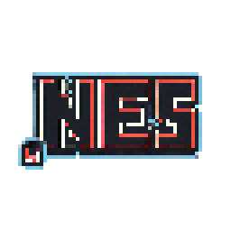
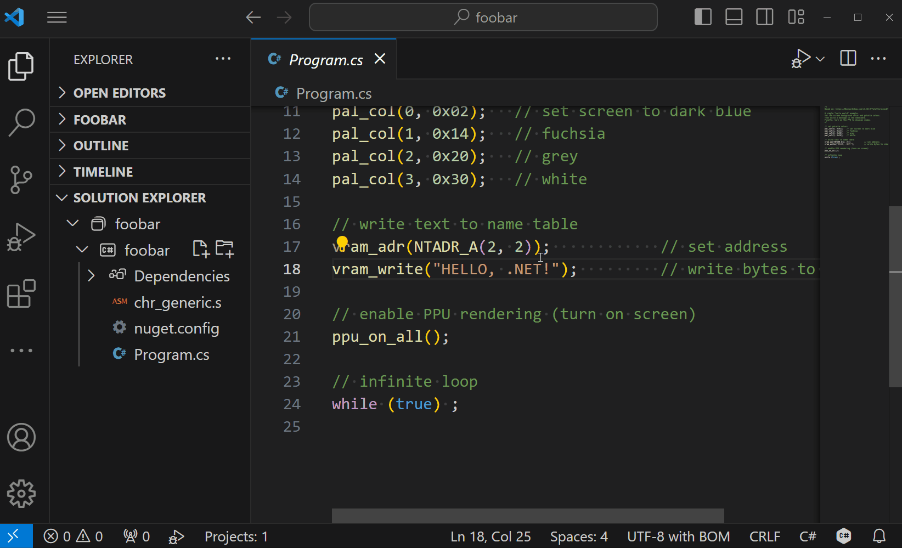
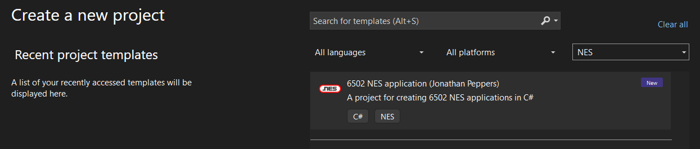

# .NES ("dot" NES)



.NET for the NES game console!



## Getting Started

Simply install the template:

```sh
dotnet new install dotnes.templates
```

Create a project:

```sh
dotnet new nes
```

Or use the project template in Visual Studio:



Build and run it as you would a console app:

```sh
dotnet run
```

Of course, you can also just open the project in Visual Studio and hit F5.

> Note that Ctrl+F5 currently works better in C# Dev Kit in VS Code.

## Anatomy of an NES application

"Hello World" looks something like:

```csharp
// set palette colors
pal_col(0, 0x02);   // set screen to dark blue
pal_col(1, 0x14);   // fuchsia
pal_col(2, 0x20);   // grey
pal_col(3, 0x30);   // white

// write text to name table
vram_adr(NTADR_A(2, 2));            // set address
vram_write("Hello, world!");         // write bytes to video RAM

// enable PPU rendering (turn on screen)
ppu_on_all();

// infinite loop
while (true) ;
```

This looks very much like ["Hello World" in
C](https://8bitworkshop.com/v3.10.0/?platform=nes&file=hello.c), taking
advantage of the latest C# features in 2023.

By default the APIs like `pal_col`, etc. are provided by an implicit
`global using static NESLib;` and all code is written within a single
`Program.cs`.

Additionally, a `chr_generic.s` file is included as your game's "artwork" (lol?):

```assembly
.segment "CHARS"
.byte $00,$00,$00,$00,$00,$00,$00,$00
...
.byte $B4,$8C,$FC,$3C,$98,$C0,$00,$00
;;
```

This table of data is used to render sprites, text, etc.

## Scope

The types of things I wanted to get working initially:

* An object model for writing NES binaries
* Building a project should produce a `*.nes` binary, that is byte-for-byte
  identical to a program written in C.
* "Hello World" runs
* Byte arrays, and a more advanced sample like `attributetable` run
* Local variables work in some form
* Project template, MSBuild support, IDE support

Down the road, I might think about support for:

* Methods
* Structs
* Multiple files
* Some subset of useful BCL methods

## Limitations

This is a hobby project, so only around 5 C# programs are known to work. But to
get an idea of what is not available:

* No runtime
* No BCL
* No objects or GC
* No debugger
* Strings are ASCII

What we *do* have is a way to express an NES program in a single `Program.cs`.

## Links

To learn more about NES development, I found the following useful:

* [8bitworkshop](https://8bitworkshop.com)
* [NES 6502 Programming Tutorial](https://www.vbforums.com/showthread.php?858389-NES-6502-Programming-Tutorial-Part-1-Getting-Started)
* [INES File Format](https://wiki.nesdev.org/w/index.php/INES)
* [6502 Instruction Set](https://www.masswerk.at/6502/6502_instruction_set.html)
* [HxD Hex Editor](https://mh-nexus.de/en/hxd/)

## ANESE License

I needed a simple, small NES emulator to redistribute with .NES that runs on Mac
and Windows. Special thanks to [@daniel5151 and
ANESE](https://github.com/daniel5151/ANESE). This is the default NES emulator
used in the `dotnet.anese` package, [license
here](https://github.com/daniel5151/ANESE/blob/8ae814d615479b1496c98033a1f5bc4da5921c6f/LICENSE).